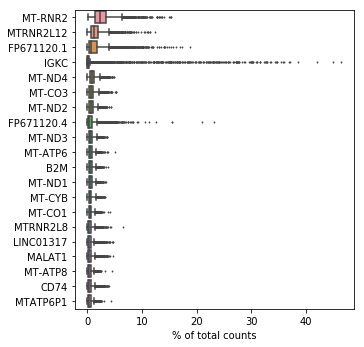
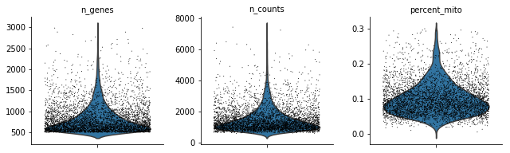
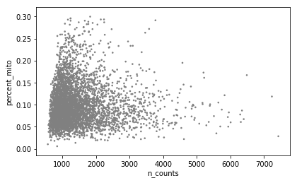
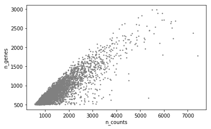
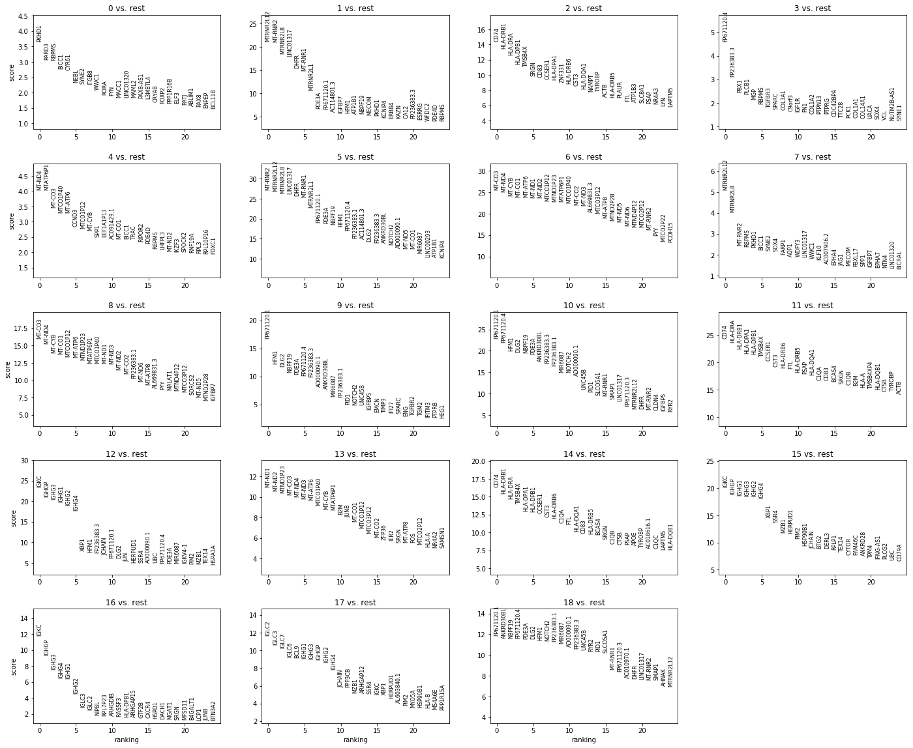
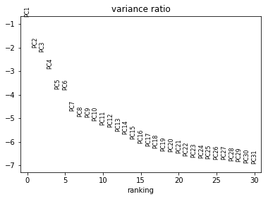
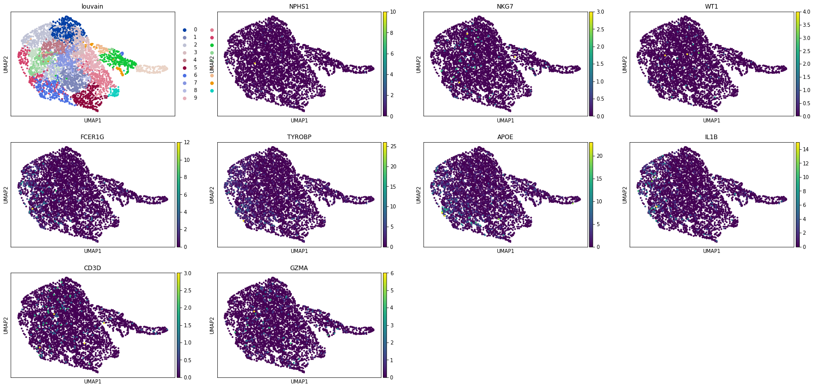

# sc309
Final python project for BIOF309


## Installing package


```python
!pip install -e ../
```


```python
from sc309 import scanpy_workflow
```


## First, import scanpy and set desired verbosity

```python
import scanpy as sc
```


```python
sc.settings.verbosity = 3
sc.logging.print_versions()
```

    scanpy==1.4.4.post1 anndata==0.6.22.post1 umap==0.3.10 numpy==1.17.4 scipy==1.3.0 pandas==0.25.3 scikit-learn==0.21.2 statsmodels==0.10.0 python-igraph==0.7.1 louvain==0.6.1


## Then, import your single cell data from your text file


```python
#gzip -d is the same as gunzip, but works on Windows

!gzip -d ../Kidney_allo_rejection_python_input.txt.gz
adata = sc.read_text(
    '../Kidney_allo_rejection_python_input.txt')  # the directory with the `.mtx` file
    # use gene symbols for the variable names (variables-axis index)
#Github cannot handle large files, so zipping compresses the large file.
!gzip ../Kidney_allo_rejection_python_input.txt
```


```python

```


```python
adata
```


    AnnData object with n_obs × n_vars = 4487 × 20477 


## Before running the commands, you can use scanpy to look at the top genes to make sure that your data has been imported correctly


```python
sc.pl.highest_expr_genes(adata, n_top=20)
```

    normalizing by total count per cell
        finished (0:00:00): normalized adata.X and added    'n_counts', counts per cell before normalization (adata.obs)





## Filtering cells and Normalization using filterRegress()


```python
scanpy_workflow.filterRegress(adata)
```

    normalizing by total count per cell


    Trying to set attribute `.obs` of view, making a copy.


        finished (0:00:00): normalized adata.X and added    'n_counts', counts per cell before normalization (adata.obs)
    extracting highly variable genes
        finished (0:00:01)
    --> added
        'highly_variable', boolean vector (adata.var)
        'means', float vector (adata.var)
        'dispersions', float vector (adata.var)
        'dispersions_norm', float vector (adata.var)
    regressing out ['n_counts', 'percent_mito']


    //anaconda3/lib/python3.7/site-packages/statsmodels/compat/pandas.py:23: FutureWarning: The Panel class is removed from pandas. Accessing it from the top-level namespace will also be removed in the next version
      data_klasses = (pandas.Series, pandas.DataFrame, pandas.Panel)


        finished (0:00:18)


```python
scanpy_workflow.summarystatsplots(adata)
```











    ---------------------------------------------------------------------------


## PCA and UMAP using topclustergenes()


```python
scanpy_workflow.topclustergenes(adata)
```

    computing PCA with n_comps = 50
        finished (0:00:06)
    computing neighbors
        using 'X_pca' with n_pcs = 10
        finished: added to `.uns['neighbors']`
        'distances', distances for each pair of neighbors
        'connectivities', weighted adjacency matrix (0:00:03)
    computing UMAP
        finished: added
        'X_umap', UMAP coordinates (adata.obsm) (0:00:08)
    running Louvain clustering
        using the "louvain" package of Traag (2017)
        finished: found 19 clusters and added
        'louvain', the cluster labels (adata.obs, categorical) (0:00:01)
    ranking genes
        finished: added to `.uns['rank_genes_groups']`
        'names', sorted np.recarray to be indexed by group ids
        'scores', sorted np.recarray to be indexed by group ids
        'logfoldchanges', sorted np.recarray to be indexed by group ids
        'pvals', sorted np.recarray to be indexed by group ids
        'pvals_adj', sorted np.recarray to be indexed by group ids (0:00:42)





## Visualizing genes visualizegenes()


```python
scanpy_workflow.visualizegenes(adata)
```








```python

```
